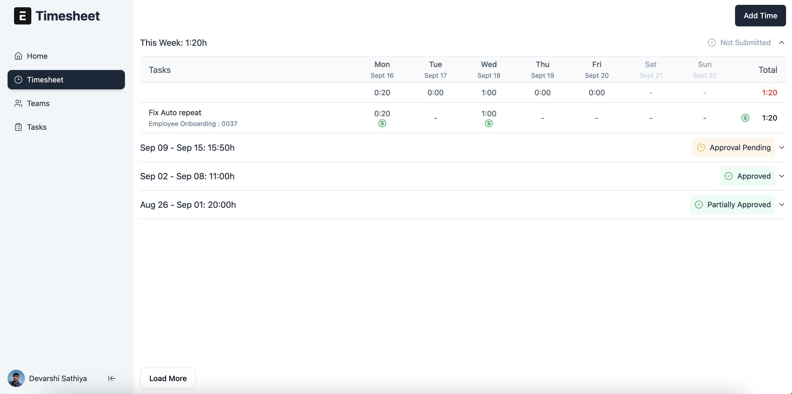

<div align="center">

<h2>Next PMS</h2>
</div>

## Introduction

**Next PMS** is a Frappe app with a modern React frontend, built to enhance timesheet, project, and resource management in ERPNext.

## Key Features

1. **Enhanced Timesheets**: Improved timesheet creation for employees with a React-based UI, allowing employees to make time entries from a single screen.

2. **Streamlined Project Billing**: Simplifies the billing process by integrating project-specific rates and billing information.

3. **Resource Management**: Easily Allocate resources on multiple project and track people working on projects and it's progress. 
4. **Simplified Workflows**: Managers may quickly work with timesheets, accept or deny them, and see the information in several ways.
5. **Custom Views**: All the pages can be saved,  ensuring quick access to the most relevant information.
6. **Reports**: Customized reports around resource management and timesheets.

## Prerequisite

Before you begin, make sure you have following apps installed on your site:

- [ERPNext](https://github.com/frappe/erpnext)
- [Frappe HR](https://github.com/frappe/hrms)

## Installation 

Run the following command to install the app.

```bash
bench get-app https://github.com/rtCamp/next-pms.git
bench --site [site-name] install-app next_pms
bench --site [site-name] migrate
bench restart
```
For local development, check out our dev-tool for seamlessly building Frappe apps: [frappe-manager](https://github.com/rtCamp/Frappe-Manager)

NOTE: If using `frappe-manager`, you might require to `fm restart` to provision the worker queues.

## Setup
Visit the [PMS Setup Guide](https://github.com/rtCamp/next-pms/wiki#setup) on wiki.

## Documentation
Please refer to our [Wiki](https://github.com/rtCamp/next-pms/wiki) for details.

## Local development setup
Visit the [guide](https://github.com/rtCamp/next-pms/wiki/Local-Development) on wiki.


## Screeenshots

<figure>
    
        <figcaption  align="center">
        <b>Time entry view</b>
    </figcaption>
</figure>


## Contribution Guide

Please read [CONTRIBUTING.md](./CONTRIBUTING.md) for details.

## License

This project is licensed under the [AGPLv3 License](./LICENSE).