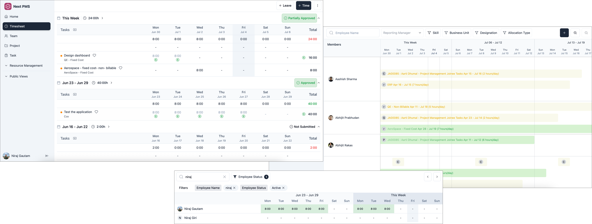

<div align="center">

<h2>Next PMS</h2>
<br>
<b>Next PMS</b> is a Frappe app with a modern React frontend, built to enhance timesheet, project, and resource management in ERPNext.
</div>
<br>
<div align="center">

</div>


## Key Features

1. **Enhanced Timesheets**: Improved timesheet creation for employees with a React-based UI, allowing employees to make time entries from a single screen.

2. **Streamlined Project Billing**: Simplifies the billing process by integrating project-specific rates and billing information.

3. **Resource Management**: Easily Allocate resources on multiple project and track people working on projects and it's progress. 
4. **Simplified Workflows**: Managers may quickly work with timesheets, accept or deny them, and see the information in several ways.
5. **Custom Views**: All the pages can be saved,  ensuring quick access to the most relevant information.
6. **Reports**: Customized reports around resource management and timesheets.

## Prerequisite

Before you begin, make sure you have following apps installed on your site:

- [ERPNext](https://github.com/frappe/erpnext)
- [Frappe HR](https://github.com/frappe/hrms)

## Installation

Run the following command to install the app.

```bash
bench get-app https://github.com/rtCamp/next-pms.git
bench --site [site-name] install-app next_pms
bench --site [site-name] migrate
bench restart
```
For local development, check out our dev-tool for seamlessly building Frappe apps: [frappe-manager](https://github.com/rtCamp/Frappe-Manager)

NOTE: If using `frappe-manager`, you might require to `fm restart` to provision the worker queues.

## Local Development with Lando

The project includes a [Lando](https://lando.dev/) configuration for a fully containerized development environment. This sets up Frappe, ERPNext, HRMS, MariaDB, Redis, and Mailpit with a single command.

### Prerequisites

- [Lando](https://lando.dev/download/) (v3.21+)
- [Docker](https://docs.docker.com/get-docker/) or [OrbStack](https://orbstack.dev/) (macOS)

### Quick Start

```bash
# First-time setup — initializes bench, installs apps, builds frontend (~10 minutes)
lando start

# If the site returns 502 after first start, the run script may not have
# triggered. Run rebuild to force setup:
lando rebuild -y

# Start the Vite frontend dev server with HMR (in a separate terminal)
lando frontend-dev
```

On first boot, Lando automatically:
1. Initializes a Frappe bench (version-15)
2. Fetches and installs ERPNext and HRMS
3. Symlinks and installs the `next_pms` app
4. Creates a development site
5. Installs frontend npm dependencies and builds production assets

After the initial setup, subsequent `lando start` will reuse the existing bench data and start bench immediately.

### URLs

| Service | URL |
|---------|-----|
| Frappe / ERPNext | https://next-pms.lndo.site |
| Frontend Dev (Vite) | https://next-pms-frontend.lndo.site |
| Mailpit (email testing) | https://mail.next-pms.lndo.site |

**Default admin credentials:** `Administrator` / `admin`

### Architecture

```
Browser → Lando Proxy (Traefik)
  ├── next-pms.lndo.site          → frappe:8000 (Werkzeug)
  ├── next-pms-frontend.lndo.site → frappe:5173 (Vite HMR)
  └── mail.next-pms.lndo.site     → mailpit:8025

frappe container (frappe/bench:latest)
  bench start runs:
    ├── Werkzeug dev server (:8000)
    ├── Socket.IO (:9000)
    ├── File watcher (:6787)
    ├── Scheduler
    └── Workers

External services:
  ├── MariaDB 10.6
  ├── Redis (cache + sessions + Socket.IO pub/sub)
  ├── Redis (background job queues)
  └── Mailpit (SMTP :1025, Web UI :8025)
```

### Directory Layout

```
next-pms/
├── .lando.yml              # Lando configuration
├── .data/                  # Bench internals (gitignored)
│   └── frappe-bench/
│       ├── env/            # Python virtualenv
│       ├── sites/          # Site data
│       └── apps/
│           ├── frappe/     # Cloned by bench
│           ├── erpnext/    # Cloned by bench
│           ├── hrms/       # Cloned by bench
│           └── next_pms → /workspace/apps/next_pms (symlink)
├── next_pms/               # Backend (Python/Frappe)
└── frontend/               # Frontend (React/Vite)
```

### Common Commands

```bash
# Bench commands
lando bench --site development.localhost migrate
lando bench --site development.localhost clear-cache
lando console                  # Frappe Python console
lando mariadb-cli              # MariaDB console via bench
lando mysql                    # MariaDB shell directly

# Frontend
lando frontend-dev             # Start Vite dev server with HMR
lando frontend-build           # Build frontend for production
lando frontend-install         # Install npm dependencies
lando frontend-lint            # Lint frontend code

# Maintenance
lando backup                   # Backup the current site
lando rebuild                  # Rebuild containers (after .lando.yml changes)
lando destroy                  # Remove all containers and volumes
```

### Troubleshooting

- **502 Bad Gateway on first start:** The bench setup may still be running (check `lando logs -s frappe`), or the run script didn't trigger. Run `lando rebuild -y` to force the setup.
- **"Module not found" errors:** Run `lando clear-cache` to flush stale Redis module mappings.
- **Frontend proxy returns 502:** Make sure `lando frontend-dev` is running in a separate terminal. The Vite dev server is not auto-started — only the production build is generated on first boot.
- **Permission errors:** Run `lando rebuild` to re-apply ownership fixes on bind-mounted directories.
- **`lando destroy` then `lando start` stuck:** After destroying, use `lando rebuild -y` (not `lando start`) to re-trigger the setup scripts.

## Setup
Visit the [PMS Setup Guide](https://github.com/rtCamp/next-pms/wiki#setup) on wiki.

## Documentation
Please refer to our [Wiki](https://github.com/rtCamp/next-pms/wiki) for details.


## Contribution Guide

Please read [CONTRIBUTING.md](./CONTRIBUTING.md) for details.

## License

This project is licensed under the [AGPLv3 License](./LICENSE).
