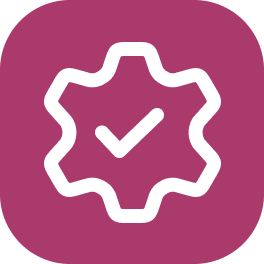

<div align="center">

<h2>Next PMS</h2>
<br>
<b>Next PMS</b> is a Frappe app with a modern React frontend, built to enhance timesheet, project, and resource management in ERPNext.
</div>
<br>

<table>
  <tr>
    <td>
      
      <p align="center">Every project at a glance - goals, budget burn, team and more in one place.</p>
      <br>
    </td>
    <td>
      
      <p align="center">Plan milestones and touchpoints on a shared project calendar.</p>
      <br>
    </td>
    <td>
      
      <p align="center">Track value, burn, profitability and more in real time - no spreadsheets.</p>
      <br>
    </td>
  </tr>
  <tr>
    <td>
      
      <p align="center">Emails - right where the work happens.</p>
      <br>
    </td>
    <td>
      
      <p align="center">A leadership cockpit - revenue, cost, utilisation, capacity and more in one view.</p>
      <br>
    </td>
    <td>
      
      <p align="center">Modern UI for logging time entries.</p>
      <br>
    </td>
  </tr>
  <tr>
    <td>
      
      <p align="center">Review and approve team timesheets in one click.</p>
      <br>
    </td>
    <td>
      
      <p align="center">See where every hour goes - by project, member and task.</p>
      <br>
    </td>
    <td>
      
      <p align="center">Spot free capacity instantly and allocate people in seconds.</p>
      <br>
    </td>
  </tr>
</table>

## Key Features

1. **Enhanced Timesheets**: Improved timesheet creation for employees with a React-based UI, allowing employees to make time entries from a single screen.
2. **Streamlined Project Billing**: Simplifies the billing process by integrating project-specific rates and billing information.
3. **Resource Management**: Easily allocate resources across multiple projects and track the people working on each project and its progress.
4. **Simplified Workflows**: Managers can quickly work with timesheets, approve or reject them, and view the information in several ways.
5. **Custom Views**: Save your frequently used filters, ensuring quick access to the most relevant information.
6. **Reports**: Customized reports around resource management, budget burn, timesheets and more.
7. **Project Command Center**: Every project gets its own workspace with Overview, Calendar, Tracking, Risks, Notes, Email and To-do tabs, bringing budget burn, invoices, milestones and client conversations onto a single page.

## Prerequisites

Before you begin, make sure you have the following apps installed on your site:

- [ERPNext](https://github.com/frappe/erpnext) - core ERP for projects, billing, customers and accounting that NextPMS builds on
- [Frappe HR](https://github.com/frappe/hrms) - HRMS for employees, leaves and attendance used by timesheets and resource planning
- [Frappe Gmail Thread](https://github.com/rtCamp/frappe-gmail-thread) - brings GMail conversations into Frappe, powering the project Email tab
- [Frappe Comment XT](https://github.com/rtCamp/frappe-comment-xt) - extended comments with mentions used across notes and feedback
- [Frappe Slack Connector](https://github.com/rtCamp/frappe-slack-connector) - Slack notifications for approvals and leaves

## Installation

Run the following commands to install the app.

```bash
bench get-app https://github.com/rtCamp/next-pms.git
bench --site [site-name] install-app next_pms
bench --site [site-name] migrate
bench restart
```

For local development, check out our dev-tool for seamlessly building Frappe apps: [frappe-manager](https://github.com/rtCamp/Frappe-Manager)

NOTE: If using `frappe-manager`, you may need to run `fm restart` to provision the worker queues.

## Setup

Visit the [PMS Setup Guide](https://github.com/rtCamp/next-pms/wiki#setup) on wiki.

## Documentation

Please refer to our [Wiki](https://github.com/rtCamp/next-pms/wiki) for details.

## Local development setup

Visit the [guide](https://github.com/rtCamp/next-pms/wiki/Local-Development) on wiki.

## Contribution Guide

Please read [CONTRIBUTING.md](./CONTRIBUTING.md) for details.

## License

This project is licensed under the [AGPLv3 License](./LICENSE).
