<div align="center">
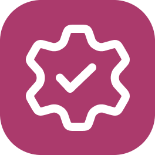
<h2>Next PMS</h2>
<br>
<b>Next PMS</b> is a Frappe app with a modern React frontend, built to enhance timesheet, project, and resource management in ERPNext.
</div>
<br>

<p align="center">
  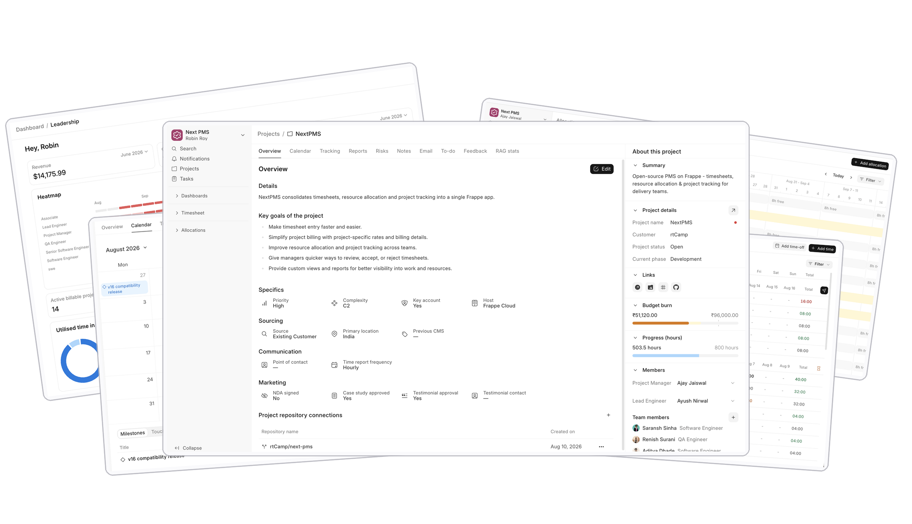
</p>

<div align="center">
  <a href="https://github.com/rtCamp/next-pms/wiki">Documentation</a>
</div>

## Key Features

1. **Enhanced Timesheets**: Improved timesheet creation for employees with a React-based UI, allowing employees to make time entries from a single screen.
2. **Streamlined Project Billing**: Simplifies the billing process by integrating project-specific rates and billing information.
3. **Resource Management**: Easily allocate resources across multiple projects and track the people working on each project and its progress.
4. **Simplified Workflows**: Managers can quickly work with timesheets, approve or reject them, and view the information in several ways.
5. **Custom Views**: Save your frequently used filters, ensuring quick access to the most relevant information.
6. **Reports**: Customized reports around resource management, budget burn, timesheets and more.
7. **Project Command Center**: Every project gets its own workspace with Overview, Calendar, Tracking, Risks, Notes, Email and To-do tabs, bringing budget burn, invoices, milestones and client conversations onto a single page.

<details>
<summary><b>Screenshots</b></summary>
<br>

<p align="center">
  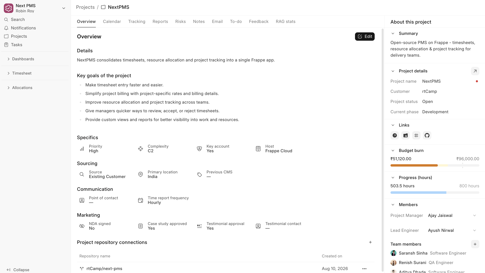
  <br>
  <b>Project overview</b>
  <br>
  <em>Every project at a glance - goals, budget burn, team and more in one place.</em>
</p>
<br>

<p align="center">
  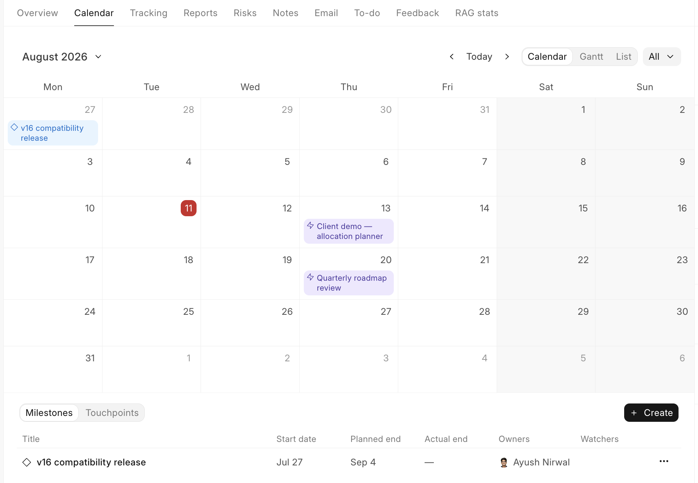
  <br>
  <b>Project calendar</b>
  <br>
  <em>Plan milestones and touchpoints on a shared project calendar.</em>
</p>
<br>

<p align="center">
  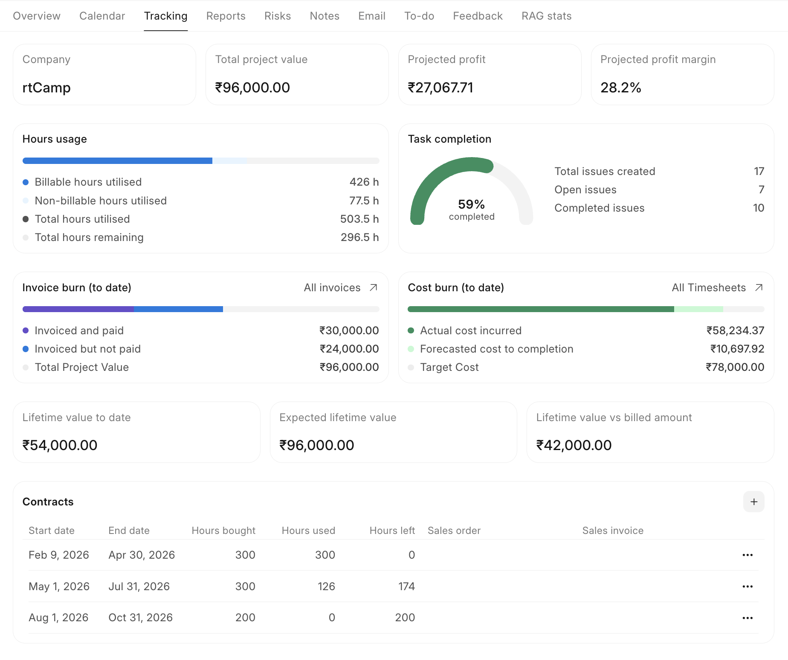
  <br>
  <b>Project tracking</b>
  <br>
  <em>Track value, burn, profitability and more in real time - no spreadsheets.</em>
</p>
<br>

<p align="center">
  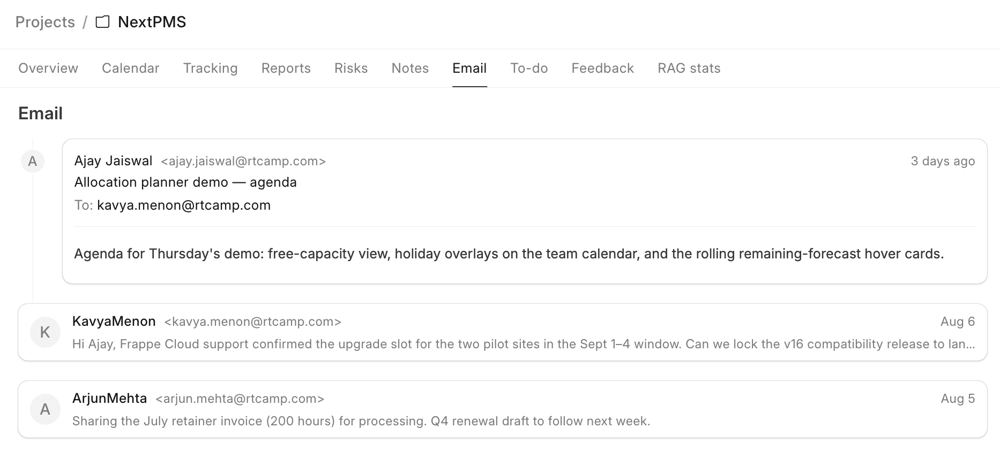
  <br>
  <b>Project email</b>
  <br>
  <em>Emails - right where the work happens.</em>
</p>
<br>

<p align="center">
  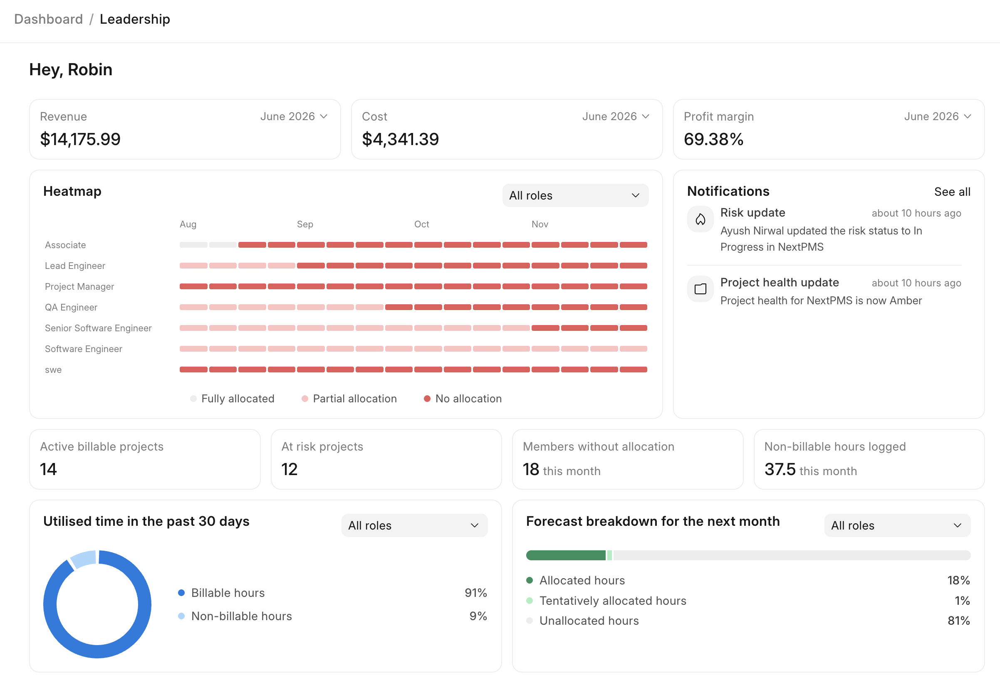
  <br>
  <b>Leadership dashboard</b>
  <br>
  <em>A leadership cockpit - revenue, cost, utilisation, capacity and more in one view.</em>
</p>
<br>

<p align="center">
  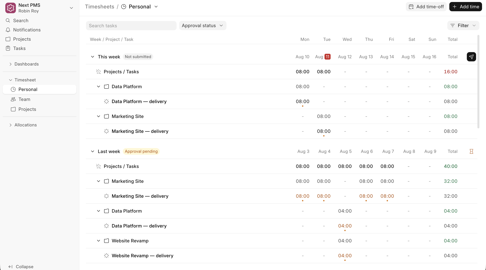
  <br>
  <b>Personal timesheet</b>
  <br>
  <em>Modern UI for logging time entries.</em>
</p>
<br>

<p align="center">
  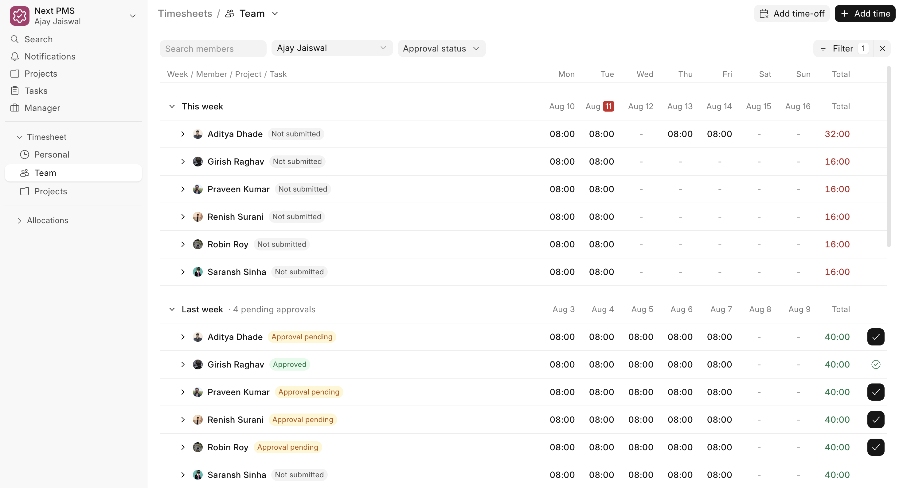
  <br>
  <b>Team timesheets</b>
  <br>
  <em>Review and approve team timesheets in one click.</em>
</p>
<br>

<p align="center">
  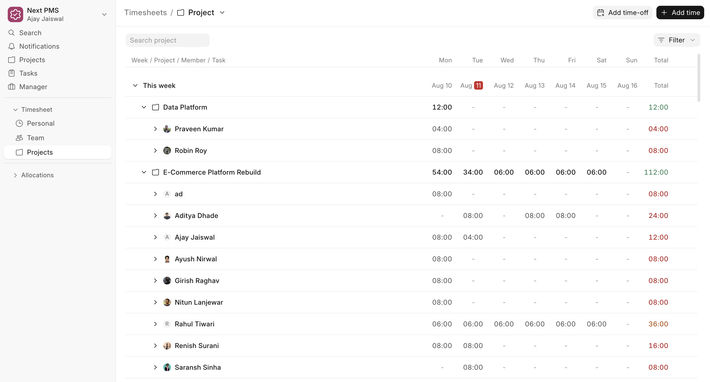
  <br>
  <b>Project timesheets</b>
  <br>
  <em>See where every hour goes - by project, member and task.</em>
</p>
<br>

<p align="center">
  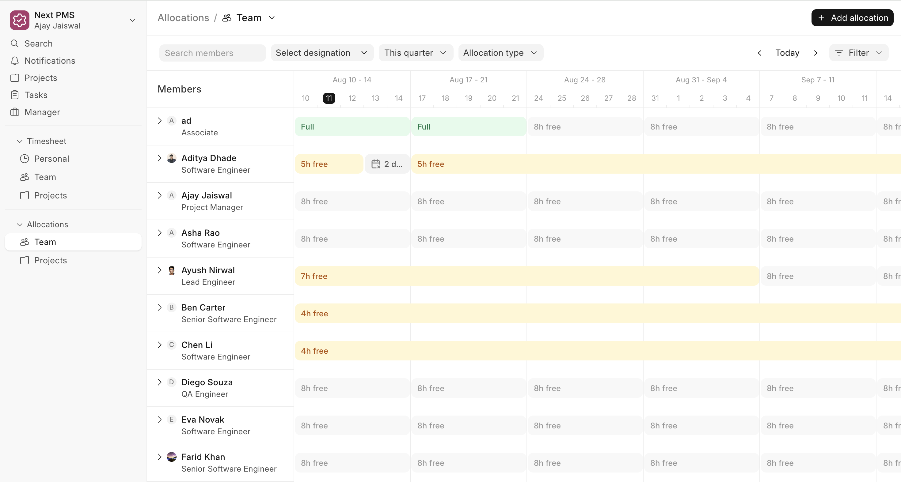
  <br>
  <b>Team allocations</b>
  <br>
  <em>Spot free capacity instantly and allocate people in seconds.</em>
</p>

</details>

## Under the Hood

- [**Frappe Framework**](https://github.com/frappe/frappe): A full-stack web application framework written in Python and JavaScript, providing the backend, database layer, user authentication and REST API for Next PMS.
- [**Frappe UI React**](https://github.com/rtCamp/frappe-ui-react): A React component library for building modern single-page applications on top of the Frappe Framework, used for the Next PMS frontend.

## Prerequisites

Install the following apps before installing Next PMS:

- [ERPNext](https://github.com/frappe/erpnext) - core ERP for projects, billing, customers and accounting that Next PMS builds on
- [Frappe HR](https://github.com/frappe/hrms) - HRMS for employees, leaves and attendance used by timesheets and resource planning
- [Frappe Comment XT](https://github.com/rtCamp/frappe-comment-xt) - extended comments with mentions used across notes and feedback

These apps are optional but recommended:

- [Frappe Gmail Thread](https://github.com/rtCamp/frappe-gmail-thread) - brings GMail conversations into Frappe, powering the project Email tab
- [Frappe Slack Connector](https://github.com/rtCamp/frappe-slack-connector) - Slack notifications for approvals and leaves

## Installation and Setup

1. Get the apps using the Bench CLI. Skip the optional ones if you don't need them.

   ```bash
   bench get-app erpnext --branch version-16
   bench get-app hrms --branch version-16
   bench get-app frappe_comment_xt https://github.com/rtCamp/frappe-comment-xt --branch version-16
   bench get-app frappe_gmail_thread https://github.com/rtCamp/frappe-gmail-thread --branch version-16
   bench get-app frappe_slack_connector https://github.com/rtCamp/frappe-slack-connector --branch version-16
   bench get-app next_pms https://github.com/rtCamp/next-pms --branch version-16
   ```

2. Install the apps on your site. Leave out any optional app you skipped.

   ```bash
   bench --site [site-name] install-app erpnext hrms frappe_comment_xt frappe_gmail_thread frappe_slack_connector next_pms
   ```

3. Migrate the site and restart.

   ```bash
   bench --site [site-name] migrate
   bench restart
   ```

4. Continue your site setup by following the [Setup Guide](https://github.com/rtCamp/next-pms/wiki#setup).

For local development, check out our dev-tool for seamlessly building Frappe apps: [frappe-manager](https://github.com/rtCamp/Frappe-Manager)

NOTE: If using `frappe-manager`, you may need to run `fm restart` to provision the worker queues.

## Contribution Guide

Please read [CONTRIBUTING.md](./CONTRIBUTING.md) for details.

## License

This project is licensed under the [AGPLv3 License](./LICENSE).
